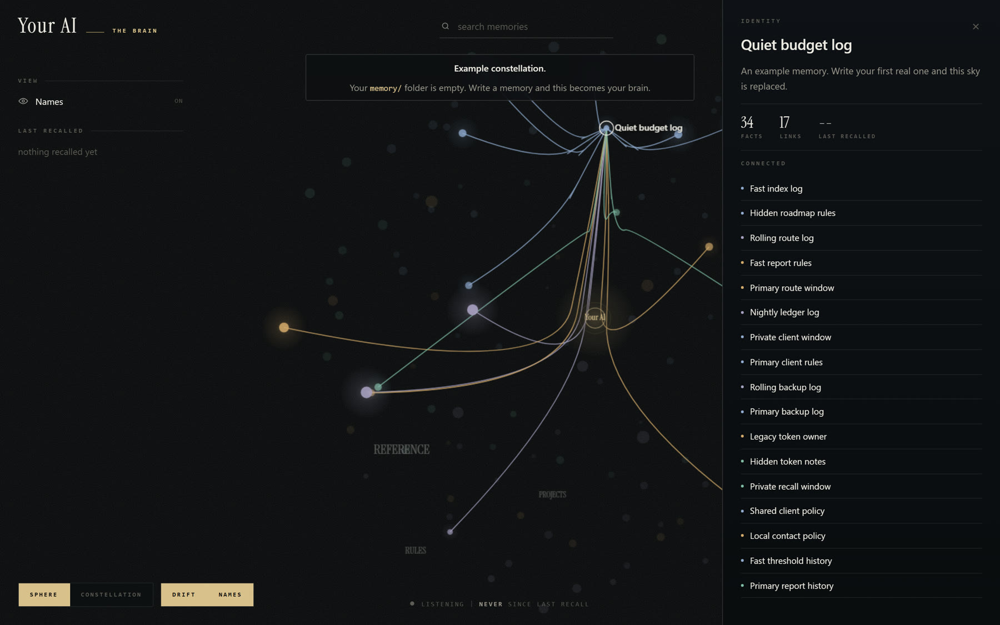
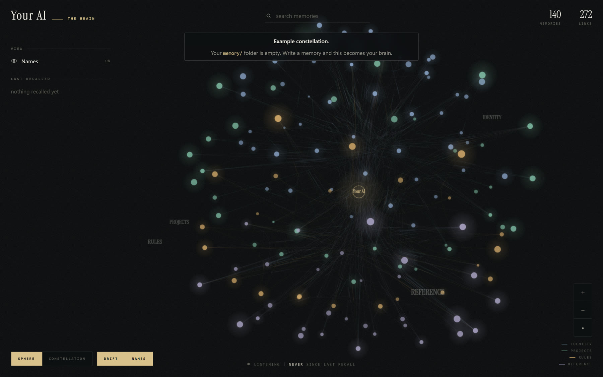
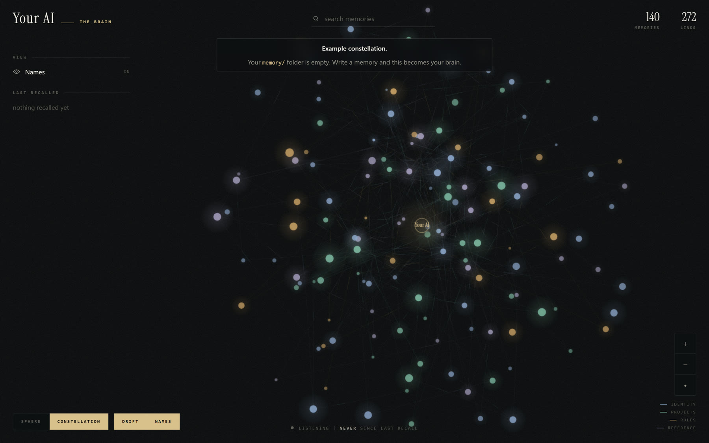
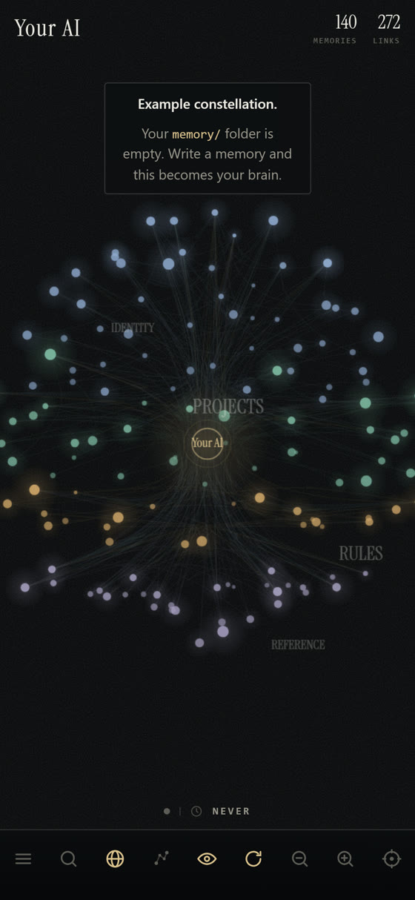

<h1 align="center">Infinite Context</h1>

<p align="center"><strong>Infinite context for your AI model.</strong><br>
Unlimited memory for coding agents, without putting it in the context window.</p>

<p align="center">
  <a href="LICENSE"></a>
  
  
  
  <a href="CLA.md"></a>
</p>

<p align="center"></p>

An agent using Infinite Context never loses a fact, and loads almost nothing on any given turn.
Every prompt gets **five pointers**, a slug and a one-line description each, and the agent opens only
the one or two memories the question actually needs. The memory can grow to thousands of facts.
The prompt stays the same size.

It runs entirely on your machine. No account, no cloud, no data leaving the building.

## Quick start

Requires Node 18 or newer. Nothing else.

```sh
git clone https://github.com/Taha-ElBouzidi/infinite-context
cd infinite-context
node tools/init.mjs            # seeds five rules, installs the embedding runtime, builds the index
node tools/install-hook.mjs    # wires Claude Code to it. Restart your session after.
```

That is the whole install. Recall works on the next prompt, by keyword **and by meaning**: a
question with no word in common with a memory still finds it. The first `init` downloads the
embedding model, about 280MB, once. The hook starts the local embedder itself whenever it is
not running, so there is nothing to keep alive by hand.

To skip semantic recall and stay keyword-only, `node tools/init.mjs --no-semantic`.

### Let your agent install it for you

Paste this to Claude Code, or any agent that can run commands:

> Clone https://github.com/Taha-ElBouzidi/infinite-context, then read its `AGENTS.md` and follow it.

`AGENTS.md` is written for the agent, every step is verifiable, and it will not report success
until the last check passes.

## The dashboard

**Your whole memory as one picture, in one command.** No build step, no npm install, no framework.
It reads `memory/` directly, so it runs on a clone that has never run anything else.

```sh
node tools/dashboard.mjs --open
```

<p align="center"></p>

**This is a first run, exactly as you will see it.** With an empty `memory/` the dashboard draws an
example constellation and says so, rather than showing you a black screen. It disappears the moment
you write a real memory.

Every memory is a node, every `[[wikilink]]` an edge, and a current runs from the machine to the
memory each time your agent recalls something. A node grows with the number of facts it holds and
the number of links into it, so the things your brain leans on are the things you see first.

| | |
|---|---|
| gold | a memory being created, and its links drawing themselves in |
| blue | a recall, running from the machine that asked to the memory it used |
| red | a memory being deleted |

### Two ways to look at it

<table>
<tr>
<td width="50%"></td>
<td width="50%"></td>
</tr>
<tr>
<td><strong>Sphere</strong> groups memories by kind and routes every link through its band, so the
middle stays readable however many you have.</td>
<td><strong>Constellation</strong> positions them by what links to what, so a cluster you can see
is a subject your brain keeps together.</td>
</tr>
</table>

Drag to turn it, scroll or pinch to zoom, click a memory to read its facts, search to filter, and
use the Names toggle for a picture of the shape alone.

### Make it yours

**One file, no build step: `dashboard/config.json`.** Edit, save, reload the page. Delete it and
the defaults come back. It documents itself: every key has a sibling `_key` line explaining it.

```json
{
  "name": "Orbit",
  "tagline": "second brain",
  "regions": [
    { "key": "PEOPLE", "types": ["person", "contact"], "color": "#E27D60" },
    { "key": "WORK",   "types": ["project"],           "color": "#41B3A3" },
    { "key": "NOTES",  "types": ["reference"],         "color": "#C38D9E" }
  ],
  "colors": { "void": "#101820", "accent": "#F6A21E", "pulse": "#4FC3F7" },
  "links": [{ "label": "My notes", "url": "https://example.com" }],
  "showMachines": false
}
```

| key | what it changes |
|---|---|
| `name`, `tagline` | the wordmark, the browser tab, the label on the core |
| `regions` | the bands, the legend, the filters and the node colours, all from this one list. Add, remove and rename freely |
| `colors` | the whole palette, ten keys. Anything you leave out keeps its default |
| `links` | your own shortcuts in the side rail. Left empty, the section does not appear |
| `showMachines` | a node per machine that recalled recently, with the current running from it |

Full reference, including what every colour key paints: **[dashboard/README.md](dashboard/README.md)**.

### On your phone

<p align="center"></p>

Add it to your home screen and it runs full screen with its own icon. The side rail becomes a sheet
and the controls become one row of icons along the bottom. Nothing is removed.

Serve it to your other devices with `--host 0.0.0.0`, or keep it on loopback, which is the default
and the safer one: a picture of your own memory is not something to put on every interface by
accident.

## What you get

Measured on the authors' own 41-query set, on a brain of about 270 memories:

| | |
|---|---|
| recall@5 | **97.6%**, identical on a laptop reaching the brain over a private network |
| cost per prompt | about **200ms** on the host, about 600ms over the network |
| context added | about **1.7k tokens**, whatever the size of the memory |
| returned nothing | **0** of 41 |
| keyword-only, for comparison | 92.7%, twice as fast, and 2 of 20 prompts came back empty |

Your numbers will differ. Measure them: `node tools/eval-recall.mjs` and `node tools/bench-recall.mjs`.

## How it works

**Memories are markdown files**, one fact per file, under `memory/`. Plain text, yours, diffable,
grep-able. Nothing is hidden in a database.

**Only the description is indexed.** Each memory has a one-line `description`, written in the words
a person would type when looking for it. That line, and the slug, are the entire retrieval surface.
A memory with a vague description exists and cannot be found, which is by design: it forces the
author to say what the memory is *for*.

**Recall returns pointers, not text.** Injecting five whole memories into every prompt to save one
file read is the wrong trade. The agent reads what it needs, and reads it fresh.

**Two channels, fused.** Keyword matching always works and catches exact names. Semantic matching,
when the local embedder runs, catches paraphrases keyword cannot. Both are on your machine.

**Behaviour rules are memories too.** Any memory carrying a `rule:` line is injected on every turn.
Five generic ones ship. Add your own by writing a memory. Change one by editing a file.

**It degrades loudly.** If the index is missing, the embedder is down, or a file cannot be opened,
the agent is told so in its context, in words, rather than silently answering from less.

## Why not a bigger context window

A bigger window is a bigger bill on every single prompt, and past a point more context makes a model
worse, not better. A memory that lives outside the window costs the same whether it holds fifty
facts or fifty thousand. This is the difference between remembering and re-reading.

## Check it is working

```sh
node tools/verify.mjs          # the whole install, exits non-zero on any failure
node tools/eval-recall.mjs     # accuracy against a fixed query set
node tools/bench-recall.mjs    # latency of the real hook, end to end
node tools/analytics.mjs       # results sheet from every logged call, with alerts
```

## Read more

| | |
|---|---|
| [docs/OPTIONS.md](docs/OPTIONS.md) | every option, what it is, a diagram, what it buys and costs |
| [docs/BENCHMARKS.md](docs/BENCHMARKS.md) | every number, how it was measured, how to reproduce it |
| [docs/GLOSSARY.md](docs/GLOSSARY.md) | every term, defined once |
| [AGENTS.md](AGENTS.md) | for the agent installing it |
| [.project/DECISIONS.md](.project/DECISIONS.md) | why it is built this way |

## Multi-machine mode

A second mode exists where one host runs `tools/brain-server.mjs` and other machines reach it over a
private network with scoped tokens and per-machine encrypted secrets. It is how the authors run it,
across three machines, one of which cannot reach the internet. It is not documented for outside use
yet. This release is **local only**.

## Platform

Tested on Windows. The engine is plain Node and should run wherever Node does. The scheduling
helpers under `tools/*.ps1` are Windows-only and are not needed for local mode.

## Contributing, security, licence

Contributions are welcome and require a signed [CLA](CLA.md), checked automatically on every pull
request. See [CONTRIBUTING.md](CONTRIBUTING.md). Report vulnerabilities privately as described in
[SECURITY.md](SECURITY.md). Licensed under [AGPL-3.0](LICENSE); commercial licences are available
from the author.
