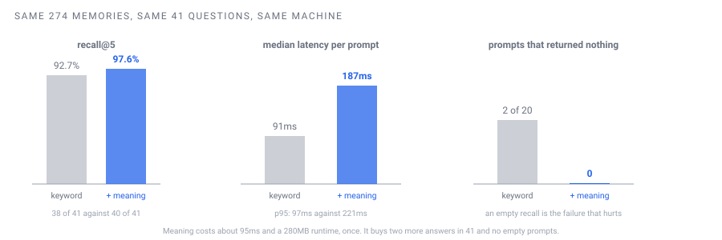

# Benchmarks

Every number here was produced by a command in this repository, on a stated corpus, on a stated
machine, and the method is written next to it so you can reproduce it or dispute it. Nothing is
estimated.

<p align="center"></p>

## The corpus and the questions

The authors' own brain: **274 memories**, and a fixed set of **41 questions** phrased the way the
owner actually types, including terse and misspelled ones, each with the memory that should come
back. A benchmark written in tidy English measures a system nobody uses. The set is private, because
the questions name real people; a generic set targeting the five seed rules ships with the code and
`eval-recall.mjs` uses it when no private set is present.

Machine: a desktop, Windows 11, Node 24. Every run below is the real hook end to end, the way a
prompt pays for it, not a bare HTTP call.

## Keyword only, against keyword plus meaning

Same corpus, same 41 questions, same machine, run one after the other in isolation from any server.
Keyword-only was produced by building the index and then deleting the vectors, with the embedder
locked out so it could not start itself.

| | keyword only | keyword + meaning (default) |
|---|---|---|
| recall@5 | **38 of 41, 92.7%** | **40 of 41, 97.6%** |
| questions that returned nothing | 2 of 20 benchmark prompts | 0 |
| latency, median | 91ms | 187ms |
| latency, p95 | 97ms | 221ms |
| tokens injected per prompt | 1735 | 1789 |

What meaning buys: two more questions out of 41 find their memory, and no prompt comes back empty.
What it costs: about 95ms per prompt and a one-time 280MB runtime. The three keyword-only misses
were *"dont ask me where the money came from"*, *"how much am i owed from my internship"* and
*"stop writing so much"*; meaning recovered the first two.

The remaining miss in both modes, *"stop writing so much"*, wants a memory about reply length and
gets five other memories about reply style instead. A near miss, counted as a miss.

Commands: `node tools/eval-recall.mjs` and `node tools/bench-recall.mjs --runs 2`.

## The same brain, over a private network

The multi-machine mode, measured from a laptop reaching the host over a private network, with the
identical code delivered through the host itself so the numbers are comparable.

| | host | laptop over the network |
|---|---|---|
| recall@5 | 40 of 41, 97.6% | 40 of 41, 97.6%, the same single miss |
| latency, median | 194ms | 609ms |
| latency, p95 | 211ms | 753ms |
| tokens injected | 1676 | 1668 |

Distance costs latency and buys no errors.

## What a fresh install costs

Measured on a clean `git clone` of the published repository, a machine with the runtime not yet
installed.

| step | measured |
|---|---|
| `npm install` (the embedding runtime) | 31s, 284MB on disk |
| first `build-index`, including the model download | 16s |
| model load in the embedder, cold | 15.5s, once per start |
| one embedding, warm | 94ms |
| `init.mjs` end to end | 30s |
| the hook, after the embedder is warm | about 190ms |

The first prompt after a cold start is keyword-only while the embedder loads; the hook says so in
the agent's context and the next prompt has meaning.

## Injection size does not grow with the memory

| memories in the brain | tokens injected per prompt |
|---|---|
| 5 | about 330 |
| 274 | about 1.7k |
| 2,740 | about 1.7k, by construction: five pointers, whatever the count |

The injection is the rules plus five pointers. Adding memories changes which five, not how many.

## Two ways these numbers lie, so you can catch them yourself

**The degraded path is faster.** Keyword-only is twice as fast as fused. A latency figure with no
mode next to it can be flattering because the thing under test never ran. `bench-recall.mjs` prints
the mode beside every number for that reason.

**A cold first call.** After idle, the first recall can take 900ms or more while things warm. A
single-run measurement can catch that and report it as typical. Use median and p95 over several
runs, never a mean, never one run.

## Reproduce it

```sh
node tools/eval-recall.mjs                 # accuracy
node tools/bench-recall.mjs --runs 3       # latency, real hook
node tools/analytics.mjs --hours 24        # results over time from every logged call
```

Put your own questions in `eval-cases.json` as `[["question", ["expected_slug"]], ...]` and your
numbers replace these.
