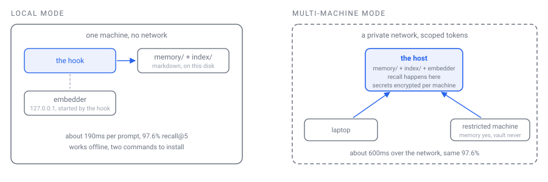
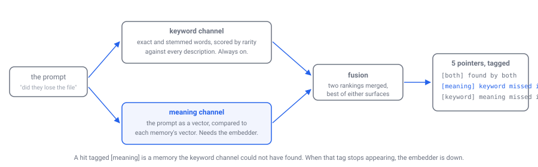
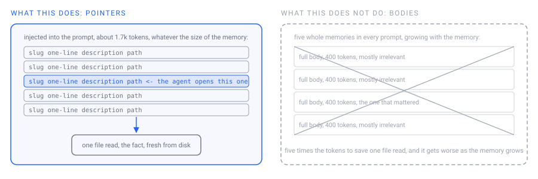

# Options, what each one is and what it buys you

Every choice in this project, defined, drawn, and measured where a measurement exists. Numbers
come from [BENCHMARKS.md](BENCHMARKS.md) and are the authors' own corpus; yours will differ, and
the tools to measure yours ship with the repository.

## 1. Where the brain runs: local, or one host for many machines

<p align="center"></p>

| | Local mode | Multi-machine mode |
|---|---|---|
| **What it is** | Everything on one machine. No server, no network, no account. | One host runs `brain-server.mjs`. Other machines send prompts to it and get pointers back. |
| **Memory lives** | on your disk | on the host's disk only, never copied to clients |
| **Recall latency, measured** | about 190ms per prompt | about 200ms on the host, about 600ms on a laptop over the network |
| **Accuracy** | 97.6% recall@5 | identical, 97.6%, on the same queries from the laptop |
| **Works offline** | yes | no: no host, no memory, and the agent is told so |
| **Secrets** | your own files | encrypted per machine; a restricted machine gets memory but never credentials |
| **Setup cost** | two commands | a private network, a certificate, tokens per machine |
| **Documented in 0.1** | yes | no, used by the authors, documented later |

**Choose local** unless you have more than one machine that needs the same memory. That is the
only reason multi-machine exists.

## 2. How recall finds things: keyword, meaning, or both

<p align="center"></p>

| | Keyword only | Keyword + meaning (default) |
|---|---|---|
| **What it is** | Exact and stemmed words, scored by rarity | The same, plus vector similarity, rankings merged |
| **Finds** | names, codes, anything unusual, exact phrasing | all of that, plus paraphrases and other languages |
| **Misses** | a question that shares no word with the memory | the same near-miss as keyword on this corpus |
| **Needs** | nothing | the local embedder, about 280MB of runtime, once |
| **Accuracy, measured** | 92.7% recall@5, 2 of 20 prompts returned nothing | **97.6% recall@5**, none returned nothing |
| **Cost per prompt, median** | 91ms | 187ms |
| **Opt out** | `node tools/init.mjs --no-semantic` | default |

Both channels run on your machine. The meaning channel is the reason a question like *"let me know
if you lost what you remember"* finds a rule whose description says *"tell me when you cannot reach
the memory"*: no word in common, found through meaning alone.

## 3. What reaches the agent: pointers, not bodies

<p align="center"></p>

| | Pointers (what this does) | Full bodies (what it does not do) |
|---|---|---|
| **Injected per prompt** | about 1.7k tokens, constant | five whole memories, grows with memory size |
| **The agent reads** | the one or two files it needs | everything, relevant or not |
| **Cost as memory grows** | flat | linear |
| **Risk** | the agent skips a file it should have opened; a rule exists to stop that | the prompt fills with stale text the agent treats as current |

Measured on the authors' brain: 1.7k tokens injected per prompt at 270 memories, and the same at
5 memories. That flatness is the whole point.

## 4. Where the rules live: as memories

Behaviour rules are memories with a `rule:` line. They are injected on every turn in `rule_order`.

| | Rules as memories (what this does) | Rules in a config file |
|---|---|---|
| **Edit** | edit a markdown file, rebuild | edit the config |
| **Versioned, diffable, linked** | yes, like any memory | usually not |
| **Drift** | one source, generated into the injection | the previous design of this project, and it drifted across four files |
| **Fresh install** | five generic seeds | would ship empty |

## 5. What is indexed: the description, only

| | Description only (what this does) | Full text |
|---|---|---|
| **Retrieval surface** | slug plus one line, written for retrieval | every word of every memory |
| **Measured** | the design that scores 97.6% | tried on 2026-08-07, made precision and recall worse |
| **Forces** | the author to say what a memory is for | nothing |

## 6. How you get the code: the repository, and git as the only backup

Memories are files, so git is the backup. The engine is a clone. There is no account and nothing
to sign up for. If you want the memory on two machines, that is option 1.

## Measuring your own

```sh
node tools/eval-recall.mjs      # accuracy: recall@5 on a fixed query set, yours or the generic one
node tools/bench-recall.mjs     # latency: the real hook, end to end, median and p95
node tools/analytics.mjs        # results over time, from every logged call
```

Every number in this document was produced by one of those three commands, and the method for each
is written down in [BENCHMARKS.md](BENCHMARKS.md).
